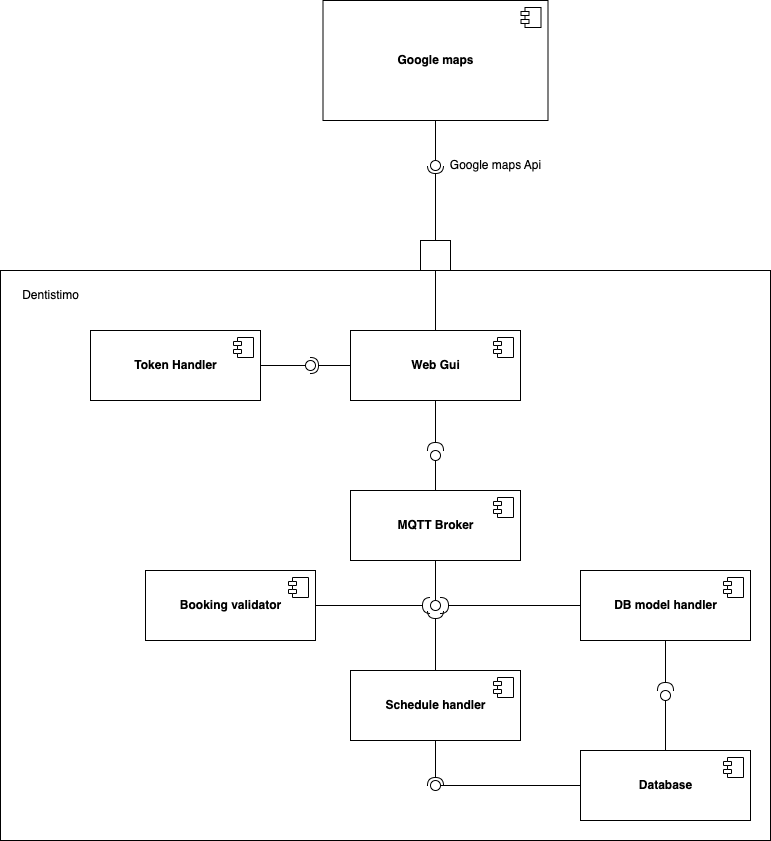
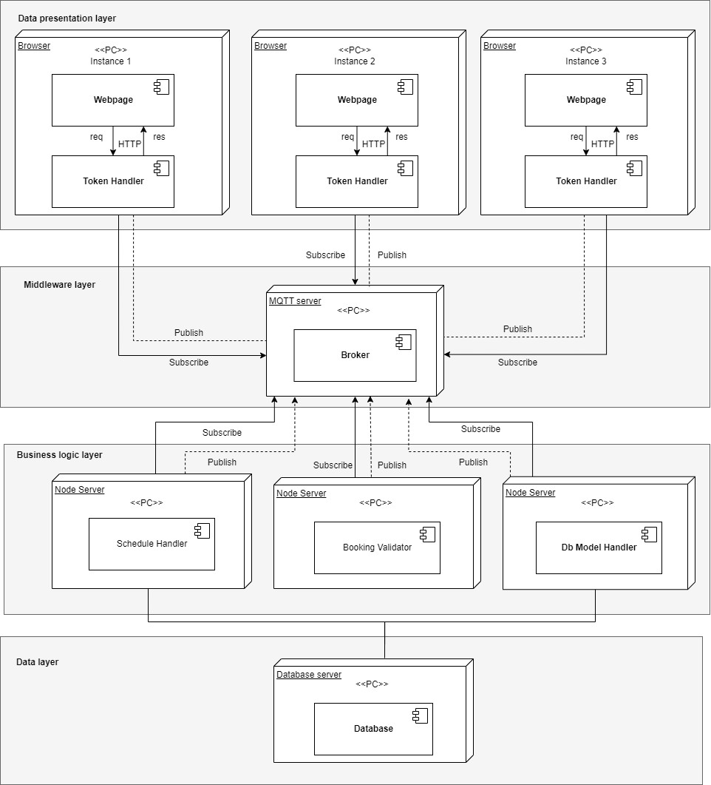
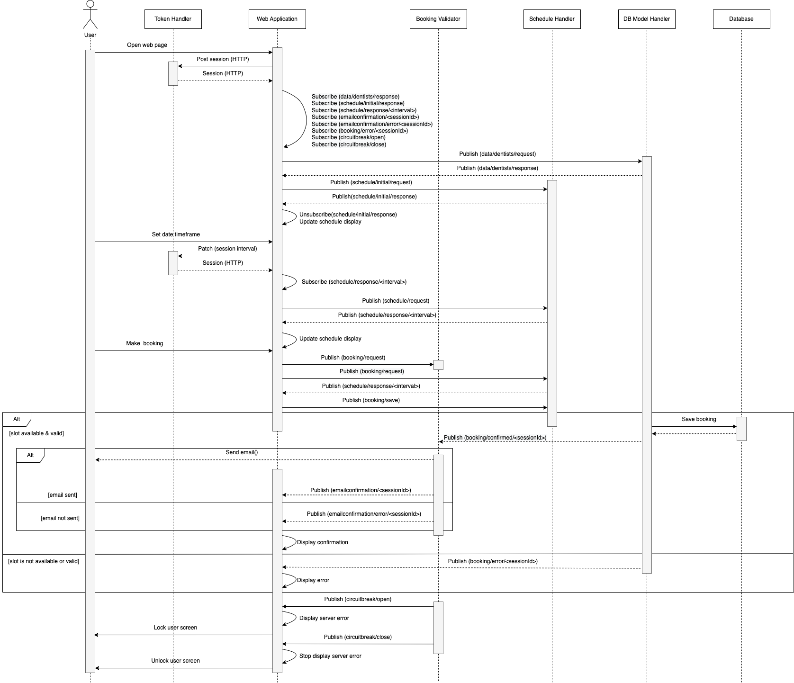

# T11 - Dentistimo Documentation

## Purpose
It is important to go to the dentist for annual checkups and take good care of your teeth.
However, it is not always easy for newcomers in Sweden to get a dentist appointment as most clinics are already full and will reject you 
as a new care-taker. Consequently, they have to manually search online for available time-slots or get a hold of a clinic through 
tiring phone calls, with low success rates.
 
Dentistimo is a web application that provides a dental appointment booking service for residents of Gothenburg. The application offers the option to check basic information for the clinics on the map and book an appointment by choosing a time and filling in personal details. 

## Components

Below links represent the project structure and will guide you to designated repositories. In each repository, a detailed description of respected component responsibilities are provided.

- [Web Application repository](https://git.chalmers.se/courses/dit355/dit356-2022/t-11/t11-web-application)

The **Web Application** is the user interface where available time slots for appointments can be spotted and bookings can be made. 
It consists of a Vue frontend and an Express backend.

- [Database Model Handler repository](https://git.chalmers.se/courses/dit355/dit356-2022/t-11/t11-database-model-handler)

The **Database Model Handler** defines the schema for the clinics and bookings, which is used to persist clinic information and bookings in the MongoDB database.


- [Booking Validator repository](https://git.chalmers.se/courses/dit355/dit356-2022/t-11/t11-booking-validator)

The **Booking Validator** queues booking requests from the Web Application and sends them to the Database Model Handler to persist the bookings in the database. 
It also sends a confirmation email for every successful booking.

- [Schedule Handler repository](https://git.chalmers.se/courses/dit355/dit356-2022/t-11/t11-schedule-handler)

The **Schedule Handler** stores clinic information and bookings from the MongoDB database to generate schedules for user-desired time intervals. 
The generated schedule is passed on to the Web Application component.


## Software requirement specification (SRS)

### Functional requirements
1. The system must allow users to book dentist appointments.
2. The system must have a map-view over Gothenburg that can be navigated.
3. The system must be able to find available times on a user-specified date.
4. The system must provide a confirmation/rejection for book appointments.
5. The system database must contain all dentist related information.
6. The system must track the availability of free time-slots for multiple dental offices.
7. The system must provide a graphical representation of the available time-slot for all the registered dental offices. 
8. The system must react to simultaneous booking by changes in the availability visible to the user.

### Non-functional requirements
1. The system should be easy for users to use.
2. The system should be fault tolerant.
3. Users should be able to book an appointment in less than 7 clicks.
4. Architectural styles such as Pipe-and-Filter, Publish/Subscribe and Client/Server are supposed to be combined.

### Constraints
#### a) Architectural Constraints
1. The system must be composed of at least 4 system components.
2. At least 4 components must be distributed.
3. There must be a middleware based on the MQTT protocol.
4. All components shall be able to handle errors *“such as wrongly formatted data inputs or out of bounds inputs for the defined interfaces”*.

#### b) Domain Constraints
1. Each appointment is 30 minutes long.
2. Appointments can start every half or full hour.
3. Each dentist has a one hour lunch break.
4. Each dentist has a 30 minute fika break.
5. Each clinic has a name, an owner, an address and coordinates, a city (Gothenburg), opening hours and number of dentists.

#### c) Request Format Constraints
1. Booking request shall follow the following format:
```
{
  "userid": "example@gmail.com",
  "dentistId": 2,
  "issuance": 1602406766314,
  "date": "2020-12-14",
  "time": "13:00-13:30",
  "name": "John",
  "sessionId": "5355QPITzxL9-tGW1yOUMITYwIYk4Vdz"
}
```
2. The system response in case of a successful booking shall follow the following format:
```
{
  "userid": "example@mail.com",
  "dentistId": 2,
  "date": "2020-12-14",
  "time": "9:30-10:00",
  "name": "John",
  "sessionId": "5355QPITzxL9-tGW1yOUMITYwIYk4Vdz"
}
```

## Software Architecture

### Architectural Significant Requirements (ASR)
* <ins>Performance:</ins> we need to be able to handle different loads of request.
* The use of MQTT and the <ins>Publish/Subscribe architecture</ins> is <ins>essential</ins> to our architecture design.
* <ins>Fault tolerance:</ins> *“The handling of resources shall be performed in a mindful way (e.g., components who are no longer active should unsubscribe from the MQTT broker)”*. 

### Architectural Diagrams
* Component Diagram



* Deployment Diagram



* Sequence Diagram



### Architectural styles
In order to create our project, the combination of following styles has been used:
* **Client/Server:** used to create separation between backend and frontend.
* **Publish/Subscribe:** used in order for the components to communicate with each other by publishing and/or subscribing to different topics through a broker, in our case Eclipse Mosquitto.
* **Pipe-and-Filter:** used to filter data that has be send from one component to another according to certain filter criteria.

## MQTT Topics

| **MQTT Topic** | **Publisher** | **Subscriber** |
|----------------|---------------|----------------|
| data/dentist/request | Web Application | Database Model Handler |
| data/dentist/response | Database Model Handler | Web Application |
| schedule/initial/request | Web Application | Schedule Handler |
| schedule/initial/response | Schedule Handler | Web Application |
| schedule/request | Web Application | Schedule Handler |
| schedule/response/\<interval> | Schedule Handler | Web Application |
| booking/request | Web Application | Booking Validator |
| booking/save | Booking Validator | Database Model Handler |
| booking/confirmed/\<sessionId> | Database Model Handler | Booking Validator, Web Application |
| booking/error/\<sessionId> | Database Model Handler | Booking Validator, Web Application |
| schedule/remove/client | Web Application | Schedule Handler |
| emailconfirmation/\<sessionId> | Booking Validator | Web Application |
| emailconfirmation/error/\<sessionId> | Booking Validator | Web Application |
| circuitbreak/open | Booking Validator | Web Application |
| circuitbreak/close | Booking Validator | Web Application |

## Technical Specifications

### Fault Tolerance and Load Balancer
The system uses the **Circuit Breaker** pattern to implement **fault
tolerance** and the chosen component for this pattern is 
the [Booking Validator](https://git.chalmers.se/courses/dit355/dit356-2022/t-11/t11-booking-validator).
This component also implements a minimum heap priority queue ordered by issuance which works as a **load balancer**,
avoiding overloading the component while ensuring that non-unintentional duplicates are stored by having a synchronous 
communication with the Database Model Handler. 

The Booking Validator combines the **circuit breaker** with the **load balancer** in order to track the load of the component.
When there is a high load in the components and the load balancer is at maximum capacity, the circuit breaker enters an open state during 30 seconds. After the timeout the circuit breaker enter a half-open state which has been modified.
Instead of verifying that the next request is successful the half-open state checks if the min heap priority queue 
is at specified threshold capacity level. If the queue size is above the specified threshold capacity, the circuit breaker enter 
the open state again and if the queue size is below the specified threshold capacity the breaker enter to a close state 
instead.

More information regarding the **circuit breaker** pattern can be 
found [here](https://martinfowler.com/bliki/CircuitBreaker.html).

### Quality of Service (QoS)
The system uses a combination of QoS 1 and QoS 2 to optimize its reliability and performance. <br>
The messages related to the booking storing process use a QoS 2 providing a warranty that the message is delivered only once. QoS 2 level has a higher overhead and takes more time to complete, but it ensures that the same request is not processed twice. Furthermore, it decreases load on the Booking Validator and increases the reliability of the data stored in th Database Model Handler.  
Messages not related to the booking storing process use a QoS level 1 assuring that the message is delivered at least once. 

## Project Methodology

We had an Agile approach and adapted Scrum practices to our development process. Scrum roles were assigned to team members and remained fixed during development.
We delivered the system incrementally in several iterations. Overall, we had four Sprints where each Sprint had a duration of two weeks. 
At the beginning of each Sprint, we did our Sprint Planning and used our Trello board for managing the tasks. 
Weekly Scrum meetings were held twice a week to report progress of each team member and possible obstacles they might have faced. 
At the end of each Sprint, we conducted our Sprint Review with the product owner.

## Software tools used

### Project Management Tools
* Project board: [Trello](https://trello.com/b/FKnvU7Dd/t-11)
* Diagram tool: [draw.io](https://app.diagrams.net/?src=about)
* Document sharing: [Google Drive](https://drive.google.com/drive)
* Communication tools: [Discord](https://discord.com/), [Slack](https://slack.com/)

### Product Development Tools
* [Node.js](https://nodejs.org/en/)
* [NPM](https://www.npmjs.com/)
* [Vue.js](https://vuejs.org/)
* [Vite](https://vitejs.dev/)
* [Bootstrap](https://getbootstrap.com/)
* [BootstrapVue](https://bootstrap-vue.org/)
* [GmapVue](https://diegoazh.github.io/gmap-vue/#v2-0-0)
* [VueGeoLocation](https://console.cloud.google.com/welcome?project=clinics-368621&authuser=0&organizationId=1043303994003)
* [Express.js](https://expressjs.com/)
* [Axios](https://axios-http.com/)
* [Eclipse Mosquitto](https://mosquitto.org/)
* [MQTT.js](https://www.npmjs.com/package/mqtt)
* [Opossum](https://nodeshift.dev/opossum/)
* [Nodemailer](https://nodemailer.com/about/)
* [Mongoose](https://mongoosejs.com/)
* [MongoDB Atlas](https://www.mongodb.com/atlas/database)
* [Min-priority queue library](https://www.npmjs.com/package/@datastructures-js/priority-queue)

## MongoDB Atlas Setup
Our project requires the user to set up a MongoDB Atlas account and store the [dentists](https://raw.githubusercontent.com/feldob/dit355_2020/master/dentists.json) and bookings for the system to work in a local PC. Follow the steps below to create a free Atlas account and connect our system to the cloud database:

1. Navigate to [MongoDB Atlas website](https://www.mongodb.com/cloud/atlas/register).
2. Preferably sign up with an existing Google account or create an account manually by filling in your details.
3. You will be forwarded to the "**Create a Database**" view. Otherwise, navigate to **Database** > **Build a Database**.
4. Choose to create a free and shared MongoDB Atlas database.
5. Choose the cloud provider aws and the region Stockholm (eu-north-1). Keep all other default settings (e.g., M0 Sandbox free tier, cluster name Cluster0) and click **Create Cluster** (takes a few minutes).
6. Create a new Database user by entering Username and Password (avoid special characters for mongoose compatibility) and click "**Create User**" button.
7. Choose "My Local Environment" to connect from.
8. Enter ```0.0.0.0/0``` for the IP Address and click "**Add IP Address**" button.
9. Navigate to Database and click the "**Connect**" button from the created database, then choose "**Connect your application**" on the  popup.
10. Copy and store the auto-generated connection string.

### Insert Dentist Information in the database
1. Navigate to the Database and click the "**Browse Collections**" button, then click "**Add My Own Data**" button.
2. Set the database name to "tests" and the collection name to "dentists".
3. Go to [dentists.json](https://raw.githubusercontent.com/feldob/dit355_2020/master/dentists.json) and copy the dentist data inside the list including the square brackets.
4. Go back to the website and click on "**Insert Document**" from the "dentists" collection, then paste the copied list and click "**Insert**" button.

### Connect Dentistimo system to MongoDB Atlas
1. Open [Schedule Handler](https://git.chalmers.se/courses/dit355/dit356-2022/t-11/t11-schedule-handler) and [Database Model Handler](https://git.chalmers.se/courses/dit355/dit356-2022/t-11/t11-database-model-handler) in IDE, or clone the repositories if you don't have it locally.
2. Add a ```".env"``` file in the root folder of the components containing the following key:
```dotenv
MONGO_ATLAS_URI="<Insert copied string from step 10>"
```
3. Replace the ```"<password>"``` placeholder with your personal password from step 6.

## Full Project Setup Instructions

**<ins>Step 1.</ins> Check if your browser supports websockets**

> ❗ If you are using <ins>Mosquitto</ins>, be aware that it does <ins>not</ins> support websockets by default 

To use websocket with the mosquitto.conf file, add the following:

```
listener 1883
protocol mqtt
listener 9001
protocol websockets
allow_anonymous true
```

**<ins>Step 2.</ins> Setup Database Model Handler component**<br>
Instructions on how to set up the Database Model Handler component can be found [here](https://git.chalmers.se/courses/dit355/dit356-2022/t-11/t11-database-model-handler/-/blob/main/README.md#setup).

**<ins>Step 3.</ins> Setup Schedule Handler component**<br>
Instructions on how to set up the Schedule Handler component can be found [here](https://git.chalmers.se/courses/dit355/dit356-2022/t-11/t11-schedule-handler/-/blob/main/README.md#setup).

**<ins>Step 4.</ins> Setup Booking Validator component**<br>
Instructions on how to set up the Booking Validator component can be found [here](https://git.chalmers.se/courses/dit355/dit356-2022/t-11/t11-booking-validator/-/blob/main/README.md#instructions).

**<ins>Step 5.</ins> Setup Web Application component**<br>
Instructions on how to set up the Web Application component can be found [here](https://git.chalmers.se/courses/dit355/dit356-2022/t-11/t11-web-application/-/blob/main/README.md#setup).

## Team Members

| Names                                 | Roles                    |
|---------------------------------------|--------------------------|
| Saif Sayed                            | Developer                |
| Robert Einer                          | Developer                |
| Emma Litvin                           | Scrum Master, Developer  |
| Danila Baryshev                       | Developer                |
| Bao Quan Lindgren                     | Developer                |
| Nicole Andrea Quinstedt               | Developer                |
| Luiz Eduardo Philippi Rosane          | Product Owner, Developer |
| Khaled Adel Saleh Mohammed Al-Baadani | Developer                |
